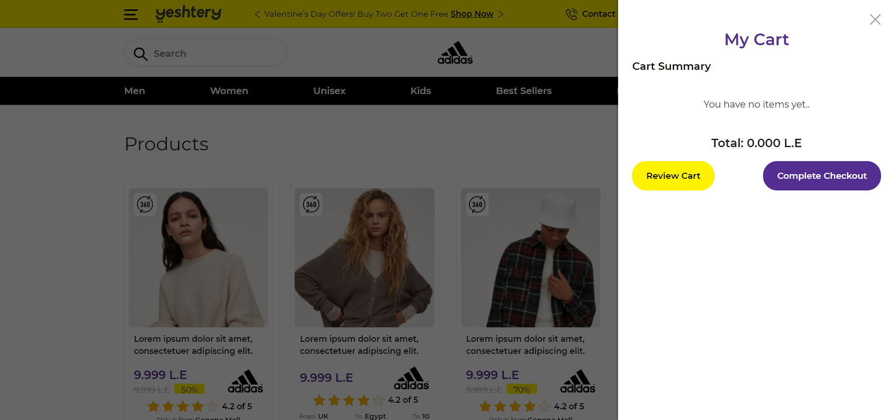

# React-Shopping-Cart

## With functionality “add to cart”.

> This project is implementation for [this design](https://xd.adobe.com/view/2186e175-b022-45db-a2f4-c9ba6e4bde30-74d5/) in react following these rules:

- File types should be js + jsx + scss.
- Folder structure:
  - public/images for static images.
  - src/images for dynamic images (dummy data images).
  - src/services for api calls (dummy data for the test).
  - src/components for other react components.
  - src/pages for router pages.

---

- Used lazy loading.
- Used class components only **No Redux or Hooks**.

## How to run loacaly
```
  1. git clone project
  2. cd client
  3. npm install or yarn
  4. yarn start
```

## Live
[Preview Live](https://mohamedghaly140.github.io/Shopping-Cart-React)

### Note

it may take some time to load product becouse of the nodejs server _deployed to heroku_

## Preview Images From Site

# Home Page


# Product Details Page


# Cart


# Added Products to Cart


